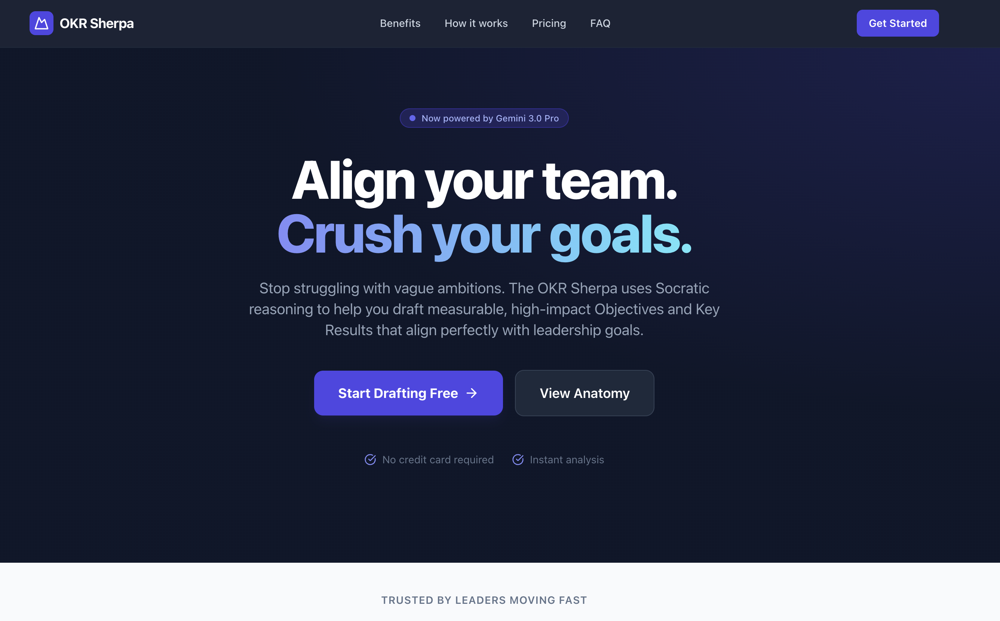
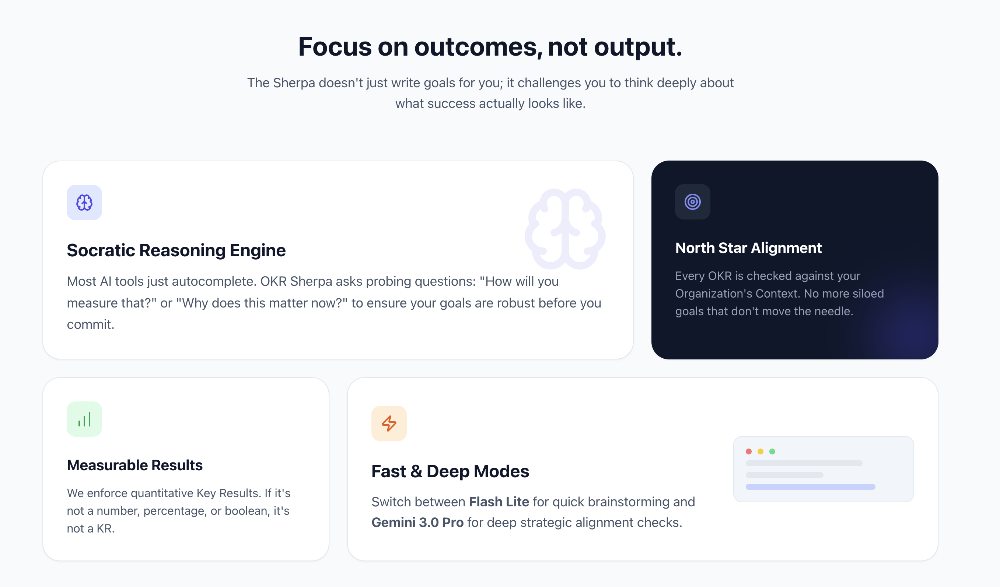
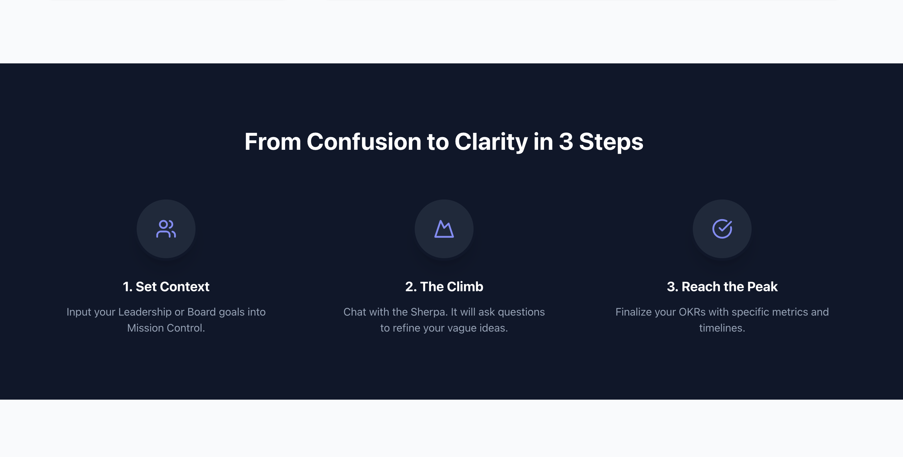

# OKR Sherpa

<div align="center">

[](https://docs.docker.com/compose/)
[](https://github.com/jleboube/OKRSherpa/stargazers)
[](https://github.com/jleboube/OKRSherpa/network/members)
[](https://github.com/jleboube/OKRSherpa/issues)
[](https://github.com/jleboube/OKRSherpa/pulls)
[](https://creativecommons.org/licenses/by-nc-sa/4.0/)

[](https://www.buymeacoffee.com/muscl3n3rd)


AI-driven Socratic OKR planning assistant powered by Google Gemini.

[Demo](https://okrsherpa.app) • [Screenshots](#screenshots) • [Features](#features) • [Quick Start](#quick-start)


</div>

## Screenshots

OKRSherpa.app Landing Page



OKRSherpa.app benefits



How OKRSherpa.app works




## Features

- **Socratic OKR Guidance**: AI-powered Socratic questioning to refine objectives
- **Dual AI Modes**: Fast (Gemini 2.5 Flash Lite) and Deep (Gemini 3.0 Pro)
- **Context Awareness**: Aligns OKRs with leadership goals and org context
- **Google OAuth**: Sign in to save your OKR data (mock implementation)
- **Privacy & Terms**: Complete legal pages included


## Quick Start

```bash
# 1. Copy environment file
cp .env.example .env.local

# 2. Add your Gemini API key
nano .env.local
# Add: VITE_GEMINI_API_KEY=your_key_here

# 3. Install dependencies
npm install

# 4. Run development server
npm run dev
```

## Docker Deployment

```bash
# 1. Ensure .env.local exists with your API key
cp .env.example .env.local
nano .env.local

# 2. Build and run
docker-compose up -d --build

# 3. Access at http://localhost:7337
```


## Tech Stack

- **Frontend**: React 19 + TypeScript + Vite
- **AI**: Google Gemini API
- **Database**: MongoDB (for future user data)
- **Deployment**: Docker + Nginx
- **Domain**: okrsherpa.app (via Cloudflare Tunnel)

## Configuration

### Environment Variables

Create `.env.local`:

```bash
VITE_GEMINI_API_KEY=your_gemini_api_key_here
VITE_GOOGLE_CLIENT_ID=your_google_client_id.apps.googleusercontent.com
```

**Get API keys:**
- Gemini API: https://aistudio.google.com/apikey
- Google OAuth: https://console.cloud.google.com/apis/credentials
  - Create OAuth 2.0 Client ID
  - Add authorized redirect URI: `https://okrsherpa.app/auth/callback`

### Port

- **Development**: 3000
- **Production**: 7337 (mapped to internal 8080)

## Project Structure

```
okr-sherpa/
├── components/           # React components
│   ├── LandingPage.tsx
│   ├── PrivacyPolicy.tsx
│   ├── TermsConditions.tsx
│   └── ...
├── services/            # API services
│   └── geminiService.ts
├── Dockerfile           # Multi-stage build
├── docker-compose.yml   # Service orchestration
├── nginx.conf           # Production web server
└── TASKS.md            # Development log
```

## Development

```bash
npm run dev      # Start dev server (port 3000)
npm run build    # Build for production
npm run preview  # Preview production build
```

## Deployment

See [TASKS.md](./TASKS.md) for detailed deployment history and configuration notes.

## License

Private project - All rights reserved
